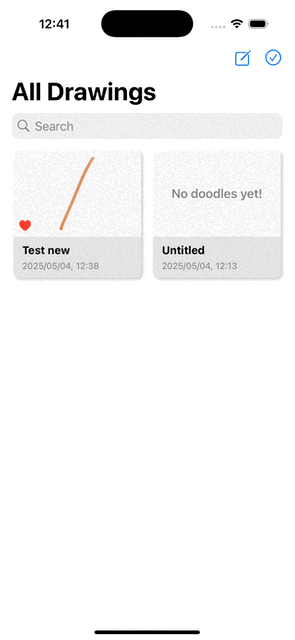

# Doodle App (SwiftUI)

A simple doodle app implemented with PencilKit and SwiftData.

## Features

1. Undo & Redo Drawing
2. Toggle ToolPickers
3. Persist data using SwiftData
4. Share Drawing as Images
