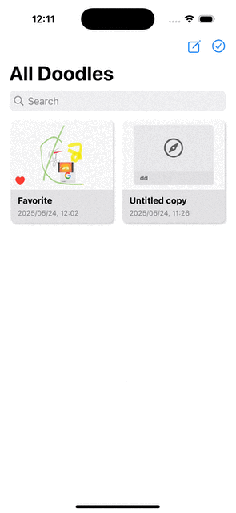
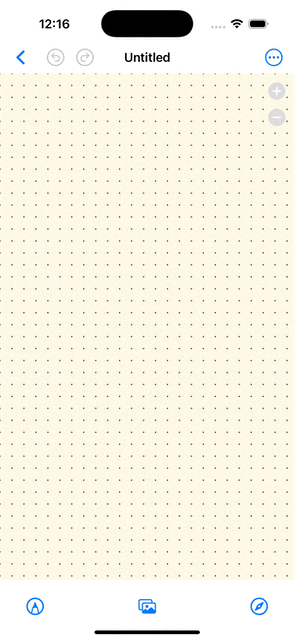
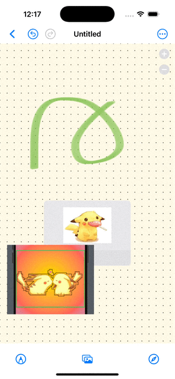
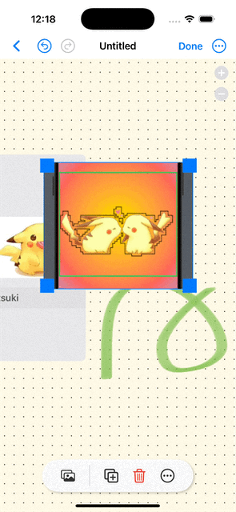
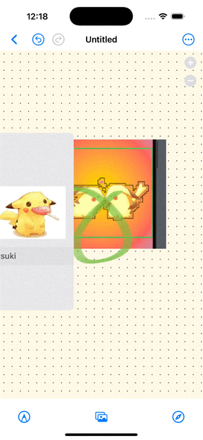
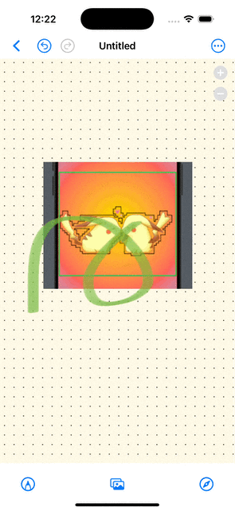

# Doodle App (SwiftUI) - A Simple Freeform Copy Cat

A doodle app (Freeform Copy Cat) implemented with 
- SwiftUI
- PencilKit for drawing-related features
- SwiftData for data persistent

## Features
This app come with the following features.

- Multiple doodles
    - searchable
    - ordered based on last modified
    - Come with Thumbnail images generated based on the content

Within each doodle: 
- Add multiple drawings, images, links
    - Toggle between Apple Pencil vs anyInput
    - Import image from Photos, Files
    - Link with Preview
- Resize and reposition the objects
- Re-arrange the object order (send to front/back, move forward/backward)
- Duplicate/delete objects
- Undo/Redo all actions above
- Show/Hide background grid
- Share, duplicate, rename, favorite/unfavorite the doodle

## Demo

### Doodles Grid Overview

### Add Objects To Doodle

### Resize and Reposition Objects

 
### Reorder Objects

### Undo/Redo Actions

### Share Doodle

## More Features to Be Added!
I am planning on adding the following features (hopefully shortly)!
- Add rich text
- Add Built-in shapes
- Export as PDF
- Multi-person Collaboration

And maybe sometime in the future
- Multi-scene support
- Sync over iCloud
